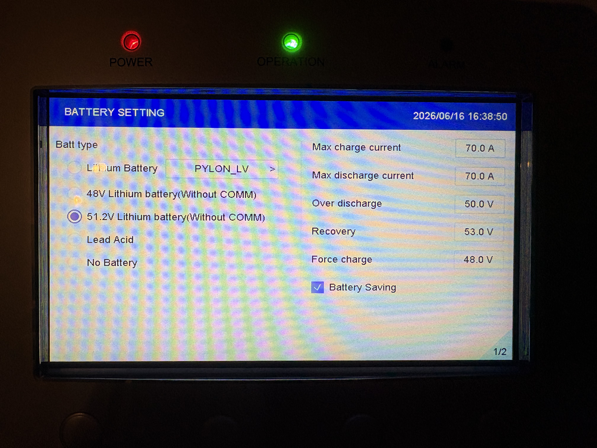
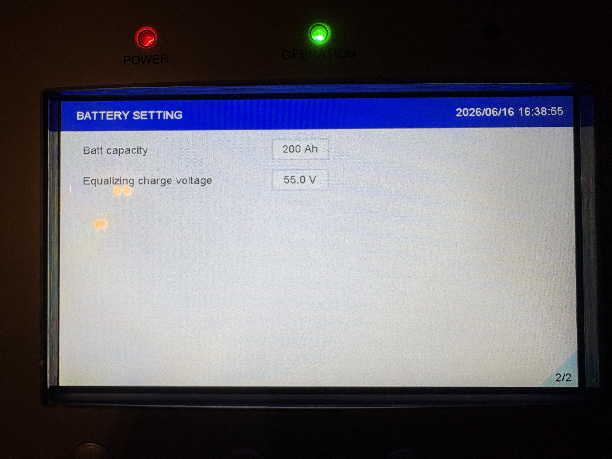

> Disclaimer: Using GivEnergy battery packs with 3rd party inverters is at your own risk.  This information is provided as a best-effort public service to extend the life of out-of-support hardware.  **No responsibility is accepted for any damage caused by following this documentation**.  The documentation may be incomplete or inaccurate.  All configurations, settings and advice should be reviewed by a competent person.

# Solis S6-EH1P-{X}K-L-PLUS

This range of hybrid inverters supports generic LiFePo 51.2V batteries.

In the inverter battery configuration screen, select `51.2V Lithium Battery(Without COMM)`

## Screen 1/2

The detailed settings can then be configured:
|Setting|Recommended Value|Notes|
|-|-|-|
|Max charge current|TBD|Consider both the documented battery limit and also the current-carrying capacity of the battery cable.|
|Max discharge current|TBD|Consider both the documented battery limit and also the current-carrying capacity of the battery cable.|
|Over discharge|TBD||
|Recovery|TBD||
|Force charge|TBD||

## Screen 2/2

|Setting|Recommended Value|Notes|
|-|-|-|
|Batt capacity|TBD|Total capacity of all battery packs connected in parallel|
|Equalizing charge voltage|TBD||